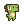
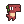

# Dino Forest ([live](https://kimhandole.github.io/dino-forest/dist/))

## Background
Dino Forest is a clone of Google Chrome T-Rex endless runner game. The player gets points for running longer distances.

## Instructions
* Select sound option by a mouse click
* Press enter to start play
* Press space bar to jump
* Press enter to retry 

## Technologies
* HTML5 / CSS3
* HTML5 canvas
* JavaScript

## Features and Implementation
No additional libraries (ex: jQuery) were used, only native JavaScript DOM manipulation and HTML 5 canvas.

### Parallax Background
Ten different 2D background layers (including lights) are each rendered in a different speed to create the parallax effect to give viewers a 3D effect.

All layers into one as below:

Including game canvas, total of 11 canvases were used.
```
const game = new Game(
    gameCanvas,
    gameContext,
    background1Context,
    background2Context,
    background3Context,
    background4Context,
    background5Context,
    background6Context,
    background7Context,
    background8Context,
    background9Context,
    background10Context
);
```

### Retry Transition Animation
Game re-starts from the position where the game was over.

### Dino Character
Four colors of dino characters are randomly generated.
*  Vita
*  Mort
*  Tard
*  Doux

```
const players = [Player1URL, Player2URL, Player3URL, Player4URL];

createPlayer() {
    this.playerImage = new Image();
    this.playerImage.addEventListener("load", this.setPlayer);
    const player = players[Math.floor(Math.random()*players.length)];
    this.playerImage.src = player;
}
```

### Jump Animation
Two types of jump sprite will triggered in an alternating manner.
```
return this.jumpTypeSwitch ? SPRITES.firstJumpType1 : SPRITES.secondJumpType1;
```

### Obstacle 
This class is extended by class Torch and Fireplace. Obstacles are randomly generated.
```
generateRandomObstacle(speed) {
    let obstacle = null;
    const obstacleTypes = ["torch", "fireplace1", "fireplace2"];
    const obstacleType = obstacleTypes[Math.floor(Math.random()*obstacleTypes.length)];

    switch (obstacleType) {
        case "torch":
            obstacle = new Torch({ position: [928, 669], speed: speed, spriteSheetSrc: TorchURL });
            break;
        case "fireplace1":
            obstacle = new Fireplace({ position: [928, 669], speed: speed, spriteSheetSrc: Fireplace1URL });
            break;
        case "fireplace2":
            obstacle = new Fireplace({ position: [928, 669], speed: speed, spriteSheetSrc: Fireplace2URL });
            break;
        default:
            obstacle = new Torch({ position: [928, 669], speed: speed, spriteSheet: TorchURL });
    }

    return obstacle;
}
```
The index of the last obstacle outside of screen will be marked and used to slice obstacles array.

```
this.obstacles.forEach((obstacle, idx) => {
    ...
    // mark index of obstacle
    if (obstacle.outOfBounds()) {
        obstacleToDeleteIdx = idx;
    }
    ...
});

// delete obstacle
if (obstacleToDeleteIdx) {
    this.obstacles = this.obstacles.slice(obstacleToDeleteIdx + 1);
    const speedOffset = 0.2;
    this.increaseSpeed(speedOffset);
}
```

### Scrolling Speed 
Scrolling speed is increased as obstacles are deleted.
```
// delete obstacle
if (obstacleToDeleteIdx) {
    ...
    this.increaseSpeed(speedOffset);
}
```

### High Score
Score object keeps track of the high score of the player.
```
class Score {
    constructor() {
        this.score = 0;
        this.scores = [];
        ...
    }

    highScore() {
        this.scores.sort((a, b) => a - b);
        return this.scores[this.scores.length - 1];
    }
    ...
}
```

### Sound
Mute and unmute options are available all times: intro, during the game, and at game over.
```
// intro
if (!this.isGamePlaying && !this.isGameOver) {
    if (this.isMuted) {
        ...
    } else {
        ...
    }
} 
// during game play
else if (this.isGamePlaying && !this.isGameOver) {
    if (this.isMuted) {
        ...
    } else {
        ...
    }
}
// game over
else if (!this.isGamePlaying && this.isGameOver) {
    if (this.isMuted) {
        ...
    } else {
        ...
    }
}
```
## Legal and Credit
All art and music assets are used for educational purpose on this project.
* Dino charaters are made by [Arks](https://twitter.com/scissormarks)
* Background layers are made by [EderMuniZz](https://twitter.com/EderMuniZz)
* Torch and fireplaces are made by [OcO](https://twitter.com/oco_93)
* Icons are made by [Freepik](https://www.flaticon.com/authors/freepik"), [Pixel perfect](https://www.flaticon.com/authors/pixel-perfect"), [Google](https://www.flaticon.com/authors/google)
* Musics are from [Ragnarok 2](http://www.playragnarok2.com/), [Uncharted Waters Online](https://uwo.papayaplay.com/uwo.do), [Lost Ark](https://www.mmorpg.com/lost-ark)